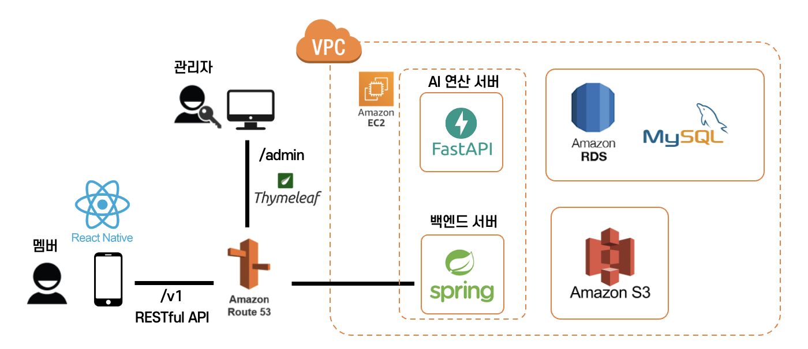

<div align="center">
  <br>
<p align="center" width="100%">
    
</p>
  <h2>탄소저감 크레딧 플랫폼, 탄플 - AI 연산 서버</h2></hr>
  <p align="center">
    
    
    
    
</div>

## 서비스 아키텍처



## pre-requisite

1. install python 3.8

```bash
# install python 3.8
```

2. clone repository

```bash
git clone https://github.com/inha-tanple/tanple-ai-server.git
cd tanple-ai-server
```

## To contributor: how to run Application
